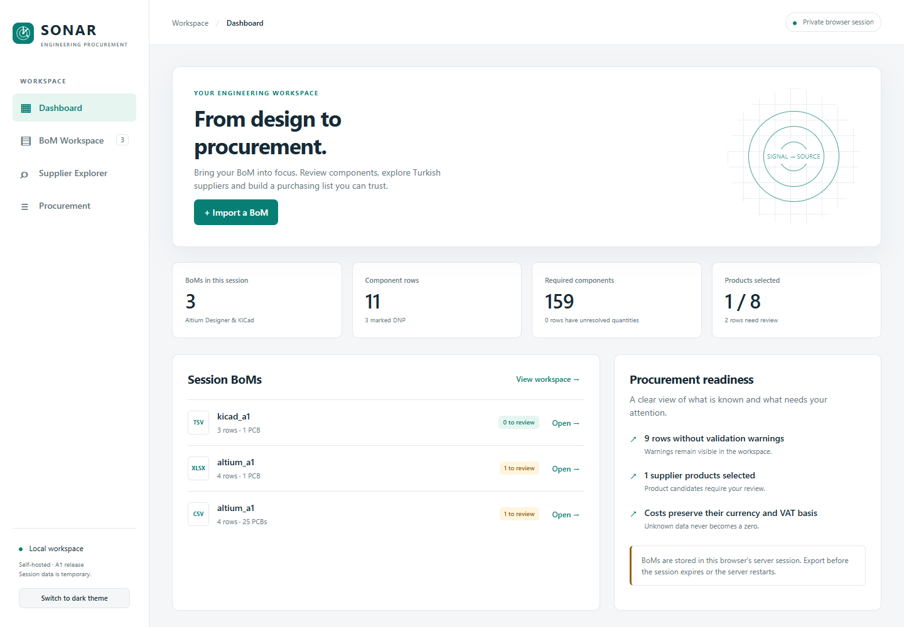
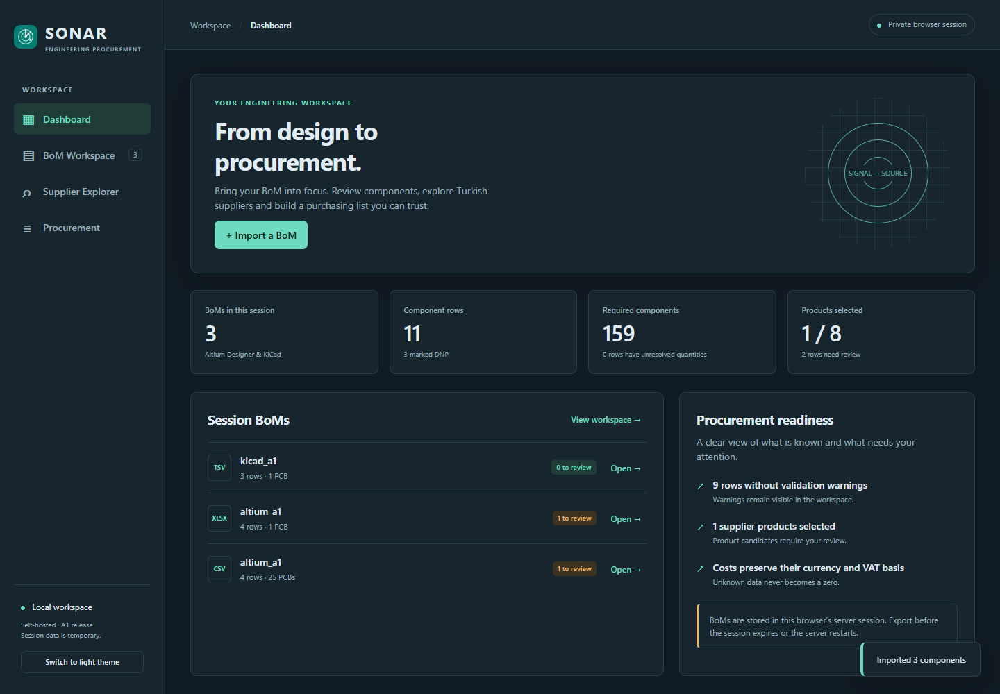
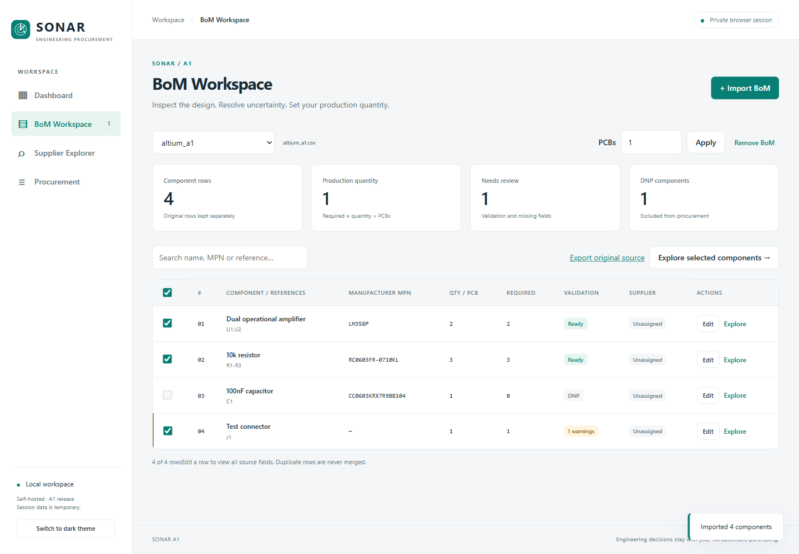
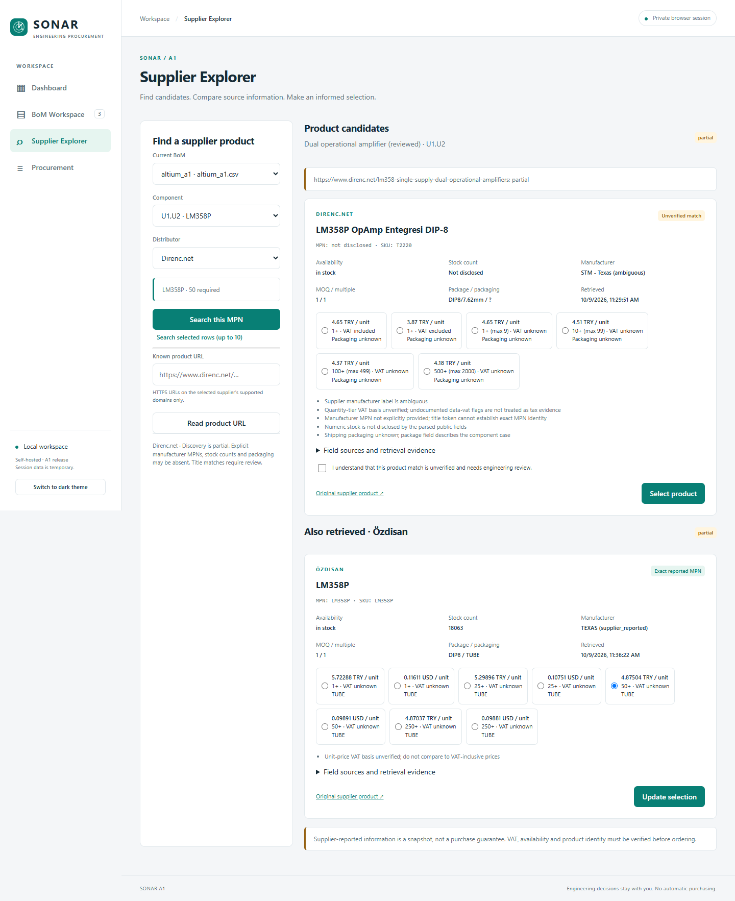
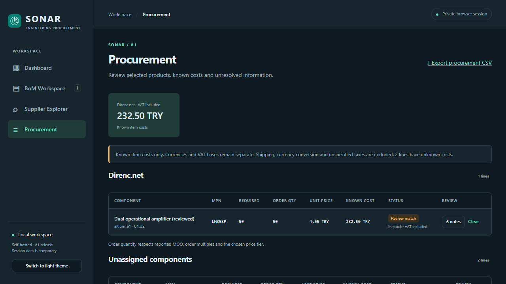
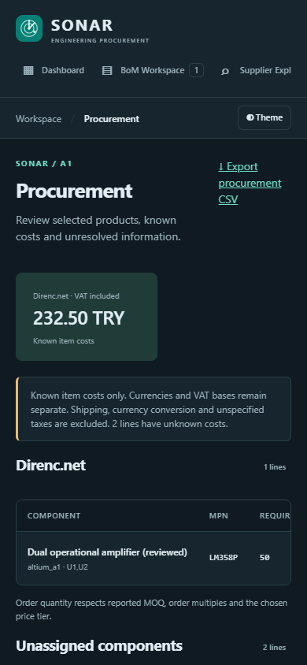

# SONAR A1 validation record

Validated on **9 October 2026**, Windows 11, Python 3.12.10, with a local browser
and the repository's authorized GitHub connection. No laboratory deployment was
performed. Synthetic engineering BoMs are explicitly labeled as examples.

## Automated results

| Check actually executed | Result |
|---|---|
| `python -m unittest discover -s tests -v` | **97 passed**: 41 preserved A0 + 56 A1 |
| `python -m pip check` | No broken requirements |
| `node --check src/sonar_web/static/app.js` | Passed syntax check |
| `git diff --check` | Passed |
| `python -m pip wheel --no-deps --wheel-dir output/wheels .` | Wheel built with packaged frontend assets |
| Clean virtual environment + locked runtime + built wheel | Installed successfully; dependency check passed |

The A1 tests cover Altium CSV/XLSX, KiCad CSV/TSV, explicit worksheet selection,
header recognition, manual mapping, missing quantity inference, invalid quantities,
MPN normalization, DNP/Fitted/unknown population handling, references/ranges,
duplicate rows/references, malformed row retention, unknown/duplicate columns,
source whitespace, formula text, expanded ZIP and file limits, exact Decimal costs,
MOQ/order multiples, tier bounds, currency/VAT separation, zero versus unknown
stock, missing prices, CSV safety and correctness. API tests cover isolation,
cookies/CSRF/origin/host checks, upload failure, strict types, session expiry,
selection, supplier jobs, facade reuse, DNS restrictions, URL allowlisting,
uncertainty acknowledgment, failure stopping, rate limiting, revision invalidation,
stale job results and active-job session recovery metadata.

Tests use synthetic fixtures and mocked retrievals; they do not claim universal
supplier availability. The current Starlette TestClient accepts the pinned HTTPX
test dependency but emits a deprecation warning recommending HTTPX2. This warning
did not fail tests and does not affect the production app's transport.

## Browser checks actually executed

Used Playwright CLI with isolated browser sessions against the local FastAPI app.

- Started at `http://127.0.0.1:8000`, verified genuine empty states and navigation.
- Uploaded `altium_a1.csv`; reviewed auto mappings and imported four rows.
- Set 25 PCBs; observed amplifier requirement 50, resistor requirement 75,
  connector requirement 25, and the DNP capacitor requirement zero.
- Edited the amplifier's name and saved it; preserved source fields remained
  inspectable. Quantities and procurement state updated.
- Imported the committed Altium XLSX workbook with worksheet selector available;
  imported its four-row BoM. Imported the three-row KiCad TSV.
- Performed a live Direnc MPN lookup. The result was partial, with an unverified
  candidate, ambiguous manufacturer, numeric stock not disclosed, and separate
  VAT-inclusive, VAT-exclusive and VAT-unknown tiers.
- Verified rejection of selecting an uncertain match without acknowledgment,
  then acknowledged and selected the product. The frontend now catches this
  condition before sending a request; the backend still independently enforces it.
- Reviewed 50 × 4.65 TRY = 232.50 TRY in procurement using that historical,
  VAT-inclusive tier. Unassigned lines retained unknown costs. Downloaded CSV and
  inspected its quantities, preserved fields, warnings, null/empty unknown values
  and DNP exclusion.
- Performed a live Özdisan known-URL retrieval of the documented LM358P product.
  The result was partial, with an explicit MPN, reported stock and TRY/USD tiers;
  VAT stayed unknown. Selected a 50+ tier; automatic search remained disabled.
- Verified both retrieved suppliers' candidates remain available for comparison.
- Checked light/dark themes, desktop and 390 × 844 mobile layout. Browser readback
  confirmed `innerWidth = document.documentElement.scrollWidth = 390`.
- Browser console was clear after reload and normal successful flows. The earlier
  intentional negative acknowledgment check generated the expected HTTP 422.

Live product URLs used:

- [Direnc.net LM358 product](https://www.direnc.net/lm358-single-supply-dual-operational-amplifiers)
- [Özdisan LM358P product](https://www.ozdisan.com/p/amplifikatorler-242/texas-lm358p-13549)

These are **historical observations from this validation date**, not current price
or stock promises. No supplier HTML, credentials, session tokens, customer data
or purchasing actions are included in the repository.

## Screenshots

Screenshots show imported **synthetic** design files and, where present, historical
live supplier information. They are captured interface states, not preloaded app data.








## Remaining limits

- Docker/Compose is unavailable on this PC: configuration was reviewed, but
  **container build/run and Linux deployment have not been executed**. IT must
  validate them on its verified runtime before deployment.
- Sessions are temporary memory, expire after inactivity and disappear on restart.
  No shared projects, accounts, database or full project save/restore in A1.
- One application process/replica; conservative supplier queue and per-IP quota
  limit throughput, especially through a shared reverse proxy.
- Imports recognize common column labels, not every customized engineering export.
  Manual mapping and row review remain necessary. Unsupported XLS/UTF-16/macro/
  encrypted files fail explicitly. XLSX formulas are text and not recalculated.
- Large BoMs are bounded to 5000 rows; import limits do not imply a measured
  multi-user capacity guarantee for an unverified laboratory server.
- A0 supplier limitations persist. Özdisan discovery is restricted; Direnc identity,
  numeric inventory and packaging may be missing. Both parsers can change with sites.
- No substitute/electrical verification, VAT inference, currency conversion,
  shipping calculation, reservation, inventory integration or automated ordering.
- IT-managed private access/HTTPS is required for deployment beyond local use;
  public production deployment is outside this release.

## Reproduce

Follow the README to install the runtime and test dependencies, then run the test
and syntax commands above. Start the application and repeat the browser flow with
the committed examples. Live retrievals may differ or fail; that does not invalidate
deterministic tests. Never bypass supplier access restrictions to reproduce a result.

For optional browser verification, Node and the free Playwright CLI are development
tools only:

```powershell
npx --yes --package @playwright/cli playwright-cli -s=sonar-validation open http://127.0.0.1:8000 --headed
npx --yes --package @playwright/cli playwright-cli -s=sonar-validation snapshot
# Use current snapshot refs for upload, editing, search and export interactions.
npx --yes --package @playwright/cli playwright-cli -s=sonar-validation resize 390 844
npx --yes --package @playwright/cli playwright-cli -s=sonar-validation console error
```
